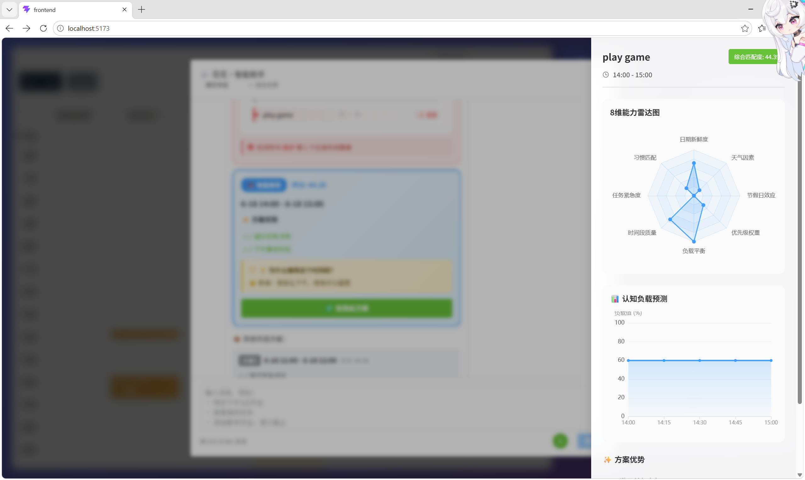
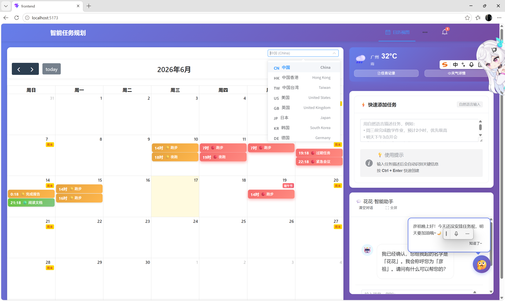
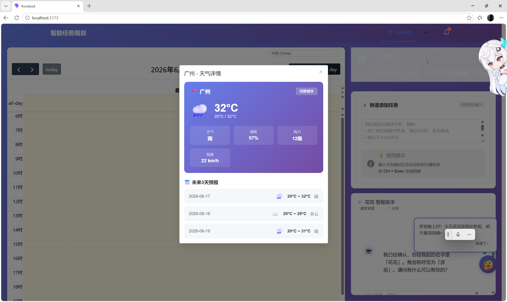

# Smart Task Planner - 智能任务规划系统


基于自然语言处理的智能日程管理与任务规划系统。用一句话描述需求，系统自动解析意图、提取信息、智能排程，同时考虑优先级、截止时间、个人习惯、50+ 国家的节假日和实时天气。

技术栈：**Vue 3 + FastAPI**，集成 hybrid NLP 引擎（LLM + 规则引擎）、Google OR-Tools 调度优化、实时 WebSocket 通知、Docker 一键部署。

我用夸克网盘给你分享了「smart-task-planner-v2.0.0.zip」，点击链接或复制整段内容，打开「夸克APP」即可获取。
链接：https://pan.quark.cn/s/a46d75737dad

---

## 核心功能

### 自然语言任务输入
输入"明天下午 3 点开会一小时"或"周末买日用品"，系统自动解析意图、提取实体，并通过学习到的个人习惯补全缺失信息。同时支持 LLM 解析（DeepSeek / OpenAI）和规则引擎兜底。

### 智能排程引擎
基于 Google OR-Tools CP-SAT 求解器的三层约束模型：**硬约束**（时间不重叠、免打扰时段）+ **人群标准**（学生 / 上班族 / 老年人模板）+ **个性化微调**（学习偏好、时段偏移）。冲突检测提供可视化反馈和一键自动调整。



### 习惯学习系统
每次手动调整任务排期时，系统自动记录调整规律。长期积累后，为新任务自动应用学习到的偏好——默认时长、偏好时段、优先级倾向，减少重复输入。

### 多国节假日日历
集成 Python `holidays` 库，覆盖 150+ 国家和地区的节假日数据。正确显示公休日、调休日、补假日。支持农历节假日（春节、中秋节等）、浮动节日及特殊周末模式（阿联酋周五至六、伊朗周四至五）。



### 天气集成
实时天气数据和 3 天预报。支持城市切换（预设中国主要城市列表）。天气信息与日历排程一同展示，辅助户外任务决策。



### AI 聊天助手
支持 Markdown 渲染的聊天界面，基于 WebSocket 流式响应。助手可解析任务、回答排程问题、生成报表、提供效率洞察。单次会话内保留对话上下文。

### 实时通知
基于 WebSocket 的通知系统，支持自动重连。包括截止时间提醒、每日总结、冲突告警、自定义通知。通知中心带未读计数和已读管理。

### 报表与分析
支持周报 / 月报自动生成，ECharts 可视化图表（优先级分布、完成状态、工作负载趋势），支持导出为 Word 文档。通过异步任务队列实现后台自动报表生成。

### 任务管理
完整的增删改查。日历支持日 / 周 / 月视图，拖拽调整时间和时长。任务详情 / 编辑弹窗包含优先级、状态跟踪、截止时间管理、快速时段按钮。骨架屏加载和优化渲染。

### 用户偏好与个性化
可配置工作时间、免打扰时段、任务缓冲时间、默认优先级。内置三种标准模板（学生 / 上班族 / 老年人）。支持自定义关键词映射任务分类。

---

## 技术栈

| 层级 | 技术 |
|---|---|
| **Frontend** | Vue 3 (Composition API), Vite, Element Plus, FullCalendar, ECharts, Pinia, Vue Router, Axios, marked |
| **Backend** | FastAPI, SQLAlchemy + Alembic, Pydantic, APScheduler, Redis |
| **AI** | DeepSeek / OpenAI API, hybrid NLP (LLM + 规则引擎), prompt engineering |
| **Scheduling** | Google OR-Tools (CP-SAT), 三层约束模型 |
| **Database** | MySQL（生产）, SQLite（开发 / 轻量部署） |
| **DevOps** | Docker, Docker Compose, Nginx（多阶段构建） |
| **Others** | Matplotlib, python-docx, python-holidays, ECharts |

---

## 架构概览

```
┌─────────────────────────────────────────────────────┐
│                    Vue 3 Frontend                    │
│  ┌─────────┐ ┌──────────┐ ┌────────┐ ┌──────────┐  │
│  │Calendar │ │ChatWindow│ │TaskInput│ │ReportChart│  │
│  │  View   │ │          │ │(NLP)   │ │  (ECharts)│  │
│  └────┬────┘ └────┬─────┘ └───┬────┘ └─────┬────┘  │
│       │           │           │             │        │
│  ┌────┴───────────┴───────────┴─────────────┴────┐  │
│  │            Pinia Stores + Axios                │  │
│  └────────────────────┬──────────────────────────┘  │
└───────────────────────┼──────────────────────────────┘
                        │ HTTP / WebSocket
┌───────────────────────┼──────────────────────────────┐
│          FastAPI Backend                             │
│  ┌────────┐ ┌─────────┐ ┌────────┐ ┌─────────────┐  │
│  │Routers │ │Services │ │Models  │ │WebSocket Mgr│  │
│  └───┬────┘ └────┬────┘ └───┬────┘ └──────┬──────┘  │
│      │           │           │              │        │
│  ┌───┴───────────┴───────────┴──────────────┴────┐   │
│  │  OR-Tools  │  NLP Engine  │  Habit Learner    │   │
│  │  Scheduler │  (LLM+Rules) │                   │   │
│  └────────────┴──────────────┴───────────────────┘   │
│                      │                                │
│         ┌────────────┼────────────┐                   │
│    ┌────┴────┐ ┌─────┴─────┐ ┌───┴────┐              │
│    │ MySQL / │ │  Redis    │ │   AI   │              │
│    │ SQLite  │ │(Cache+Q)  │ │  API   │              │
│    └─────────┘ └───────────┘ └────────┘              │
└──────────────────────────────────────────────────────┘
```

---

## 快速开始

### 方式 0：Docker 一键启动

```bash
docker compose -f docker-compose.lite.yml up -d
```

打开 http://localhost 使用前端，http://localhost:8080/docs 查看 API 文档。

> **前置条件**: [Docker](https://www.docker.com/products/docker-desktop/) 24.0+、[Docker Compose](https://docs.docker.com/compose/install/) v2.0+
> 需要 [DeepSeek API Key](https://platform.deepseek.com/)（免费）和 [和风天气 API Key](https://www.qweather.com/)（免费）。

### 方式 1：Docker 完整部署（SQLite 轻量版）

```bash
# 1. 克隆项目
git clone https://github.com/YOUR_USERNAME/smart-task-planner
cd smart-task-planner

# 2. 配置环境变量
cp .env.docker .env
# 编辑 .env，填入 DeepSeek API Key 和天气 API Key

# 3. 启动
docker compose -f docker-compose.lite.yml up -d

# 4. 打开浏览器访问 http://localhost
```

### 方式 2：本地开发

**环境要求**: Python 3.10+, Node.js 18+

```bash
# 后端
cd backend
python -m venv venv
.env\Scriptsctivate    # Windows
pip install -r requirements.txt
uvicorn main:app --reload --host 0.0.0.0 --port 8080

# 前端（新开一个终端）
cd frontend
npm install
npm run dev
```

前端 http://localhost:5173，API 文档 http://localhost:8080/docs。

---

## 项目结构

```
├── backend/
│   ├── main.py                  # FastAPI 应用入口
│   ├── app/
│   │   ├── models/              # SQLAlchemy ORM 数据模型
│   │   ├── routers/             # 12 个 API 路由模块
│   │   ├── services/            # 约 30 个业务逻辑模块
│   │   │   ├── or_tools_scheduler.py   # OR-Tools 排程引擎
│   │   │   ├── hybrid_parser.py        # LLM + 规则 NLP 解析
│   │   │   ├── holiday_service.py      # 多国节假日服务
│   │   │   ├── scoring_engine.py       # 三层评分模型
│   │   │   ├── report_generator.py     # 周报/月报生成
│   │   │   └── ...                     # 天气、通知、缓存等
│   ├── config/                  # 配置文件
│   └── tests/                   # 测试套件
│
├── frontend/
│   ├── src/
│   │   ├── components/          # Vue 组件（日历、聊天、天气等）
│   │   ├── views/               # 页面视图（主页、个人中心）
│   │   ├── stores/              # Pinia 状态管理
│   │   └── services/            # WebSocket 等服务模块
│
├── docker-compose.yml           # 完整部署（MySQL + Redis）
├── docker-compose.lite.yml      # 轻量部署（SQLite）
├── .env.docker                  # 环境变量模板
└── docs/screenshots/            # README 截图
```

---

## 能力展示

**全栈开发** — 完整的 Vue 3 SPA + 模块化 FastAPI 后端。Pinia 状态管理 + Vue Router 客户端路由 + RESTful API 设计 + 组件化架构。

**算法设计** — Google OR-Tools CP-SAT 实现约束排程：硬约束（时间不重叠）+ 人群标准（学生 / 上班族 / 老年人）+ 个性化微调。冲突检测支持自动解决和手动覆盖。

**AI 集成** — 混合 NLP 方案：LLM 解析（OpenAI 兼容 API）+ 规则引擎兜底。Prompt engineering 实现结构化实体提取。习惯学习系统长期适应用户行为。

**系统设计** — 分层架构（路由 / 服务 / 数据模型）。三级缓存策略（Redis + 内存 + localStorage），TTL 自动过期。异步任务队列处理后台任务。

**实时通信** — WebSocket 推送通知，自动重连 + 心跳检测 + 可见性感知连接管理。

**数据库设计** — SQLAlchemy ORM + Alembic 迁移，同时支持 MySQL 和 SQLite。

**DevOps** — 多阶段 Docker 构建，前后端分离部署（Nginx + Python），环境变量驱动配置。

**国际化** — 多国节假日日历支持 50+ 国家，正确处理周末映射、法定假日规则、农历事件、调休制度。

---

## 公网部署

```bash
# 在云服务器上拉取
git clone https://github.com/YOUR_USERNAME/smart-task-planner
cd smart-task-planner

# 配置密钥
cp .env.docker .env
# 编辑 .env 填入真实的 API Key

# 启动（轻量版，无需外部数据库）
docker compose -f docker-compose.lite.yml up -d --build

# 访问 http://服务器IP:80
# API 文档 http://服务器IP:8080/docs
```

> 生产环境建议使用 `docker compose -f docker-compose.yml up -d --build`（MySQL + Redis）。

---

## API 文档

服务启动后访问：

- **Swagger UI**: http://localhost:8080/docs
- **ReDoc**: http://localhost:8080/redoc

### 主要路由

| 路径 | 说明 |
|---|---|
| `GET /api/tasks` | 任务 CRUD |
| `POST /api/chat/stream` | AI 聊天（流式响应） |
| `GET /api/weather/current?city=...` | 当前天气 |
| `GET /api/holidays/month?year=&month=&country=` | 月节假日 |
| `GET /api/holidays/countries` | 支持的国家列表 |
| `GET /api/preferences/` | 用户偏好 |
| `GET /api/notifications/` | 通知列表 |
| `POST /api/report/generate` | 报表生成 |
| `POST /api/scheduling/optimize` | 排程优化 |
| `WS /ws/{user_id}` | WebSocket 实时更新 |
